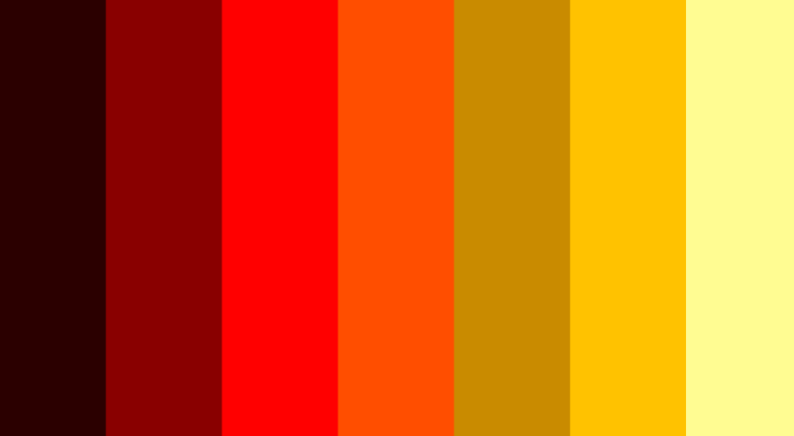

# GAM703 Engine

## Game Description

### Objective: Destroy All the Enemies

You are a cube and you need to destroy all the enemies by colliding with them

### Game Controls:

  - WASD Movement
  - Press space to slow down enemies (A blue cube will indicate when the power up is ready)

### How to Win

Every enemy has a power level represented by a color  
If an enemy has a lower power level it will flee you  
If an enemy has a higher power level it will seek you  
To destroy an enemy your power level must be higher than the enemy's  
If a power value is between two levels the resulting color will be a lerp between the lower and higher level  

There are 7 power levels shown from left to right in the image:
  - Weakest
  - Weaker
  - Weak
  - Normal
  - Strong
  - Stronger
  - Strongest

### How to Build

The project is built with CMake  
All 3rd-party libraries are available when cloning the repo  
You can generate a Visual Studio Solution using ./generate_vs_projects.sh in the root directory

### Documentation

The project documentation is generated with Doxygen and is located in ${CMAKE_BINARY_DIR}/bin/docs if Doxygen was found on the system
